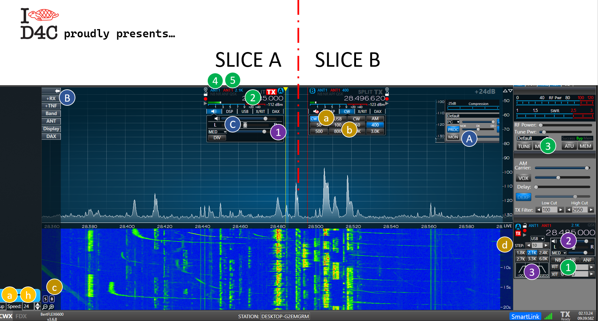
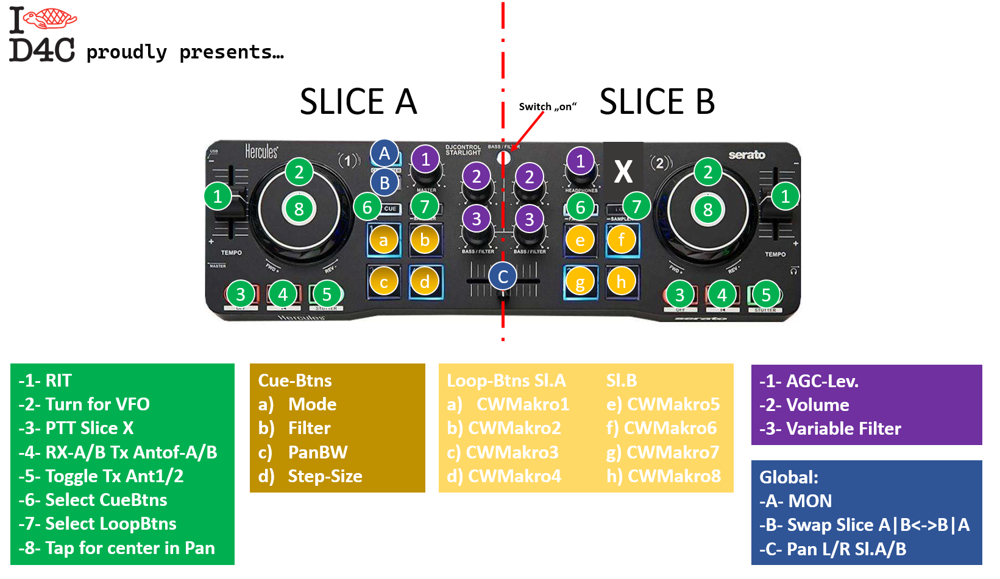
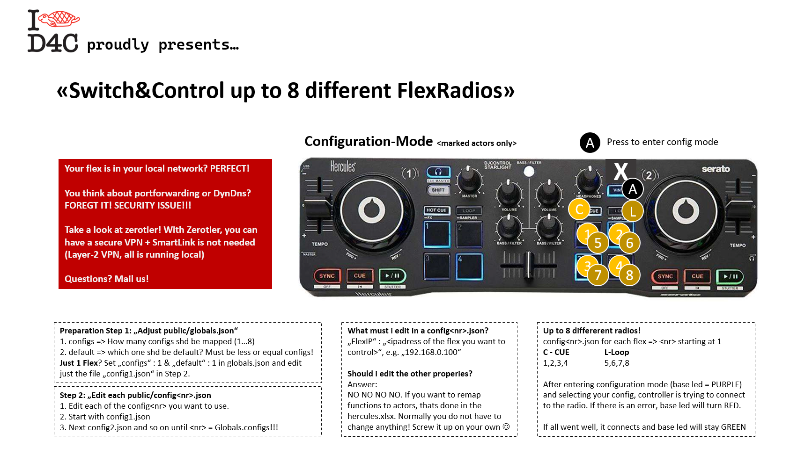
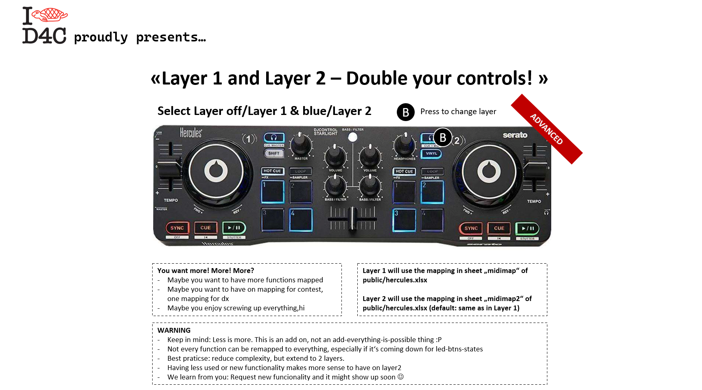

<h1 align="center">xxFlexradioController "Hercules"</h1>
<h4 align="center"> brought to you by I	&#10084; D4C -- a DM5XX Project</h4>

 
<h2>You like FlexRadio? Your spent your last money on a Flex6600, 6400, 6500? Right decission! But now you need to save money for your Maestro? Man, this might take a while, i know... So what to do meanwhile? Hey - grab 75€ and you are back in the game until you can buy a maestro :P! </h2>

  Yes! Here is something for you! How about using an external DJ-Midi-Controller to control your FlexRadio? Thanks to FlexRadio and Stephen Houser this is already possible in Node-Red - but now its even easier!

No more Node-Red-Setup needed, no Raspberry setup, no update hell, no need to become a linux expert - and no need to use an Ipad, OSX or whatever!
 

  <b>And even better: Your friends all have flex radios and they let you play with them? EASY going! You can jump through all the different flex radios with your fingertips! Take a look at the entering configuration mode instructions down below!</b>

xxFlexradioController DJ Console Hercules Starlight supports 3 Faders, 2 Turning-Wheels with 1 Touch-Btn in the middle, 6 Rotary potis, 26 Buttons (using 2x Cue+4, 2x Loop+4), 4 globaly used buttons => THATS A TOTAL of 43 actors! Not enough? IN 2 LAYERS => 86 possible actors assignable! Jump to "ADVANCED" for more info.

Just buy a Hercules DJ-Control Starlight USB, download the software here (using the BatchStarter.exe for Windows 10/11 to start it - hint: install donetframework first => complete package is in the <a href="https://www.hamradioland.de/rh.zip" target=_blank>DOWNLOAD package for WINDOWS 10/11</a> here!), install the controller, edit the public/config.json and choose your FlexRadios-IP and !!!!WOW!!!! ITS WORKING OUT OF THE BOX!!!!

  The Software is designed to use allmost of the buttons of the hercules console. Down below you can see how the buttons are mapped (which cld be changed in public/hercules.xlsx). What is described for Slice A will also be on Slice B - Green, Yellow, Purple work for each Slices A and B. <b>Since they are the same for both Slices, i only described them for the left side :)</b>  Blue means global and not slice specific functionality. COntroller is also working in multiFlex environments. 

  <b>ADVANCED</b>: Still not enough actors?</b> Your xxFlexradioController is coming with 2 Layers! You can for example have Layer 1 setup (mapped) for DXing, and Layer 2 for contest. You can switch any time. Default (after restart) will be Layer 1. See instructions down below.

  <b>Thanks to FlexRadio! You created a master piece of SDR! AND: Thanks for sharing the API with your community. This is something really special!</b>

  <b>Current Version: 0.9d - 20240218</b> Find a quick documentation  <a href="https://www.hamradioland.de/rh.pdf" target=_blank>here</a>

### Where to buy the hardware?
Amazon, Ebay - even used. Its damn cheap!

Buy from Hercules USA (about 99$):
https://eshop.hercules.com/en_us/djcontrol-starlight.html

Buy from Thomann (EU, about 75€):
https://www.thomann.de/intl/hercules_dj_control_starlight.htm

### What else?
You need more beautiful, useful and worth every cent ham radio hardware => Go to <a href="http://hamparts.shop" target=_blank>HAMPARTS.SHOP</a> 
There you can find some more stuff from us - we give something back to the community, so help us develop some cool ham radio parts!

### FAQ
Q: Which controllers are supported?
A: Only a Hercules DJ Control Starlight USB controller is supported so far. Since its damn cheap and reliable, why wasting my time with others... :P

Q: Can you support controller xyz?
A: Yes, i can, but you need to donate one to me! Since this software is GLP3 - just implement it for yourself, create a pull request with a new controller implementation included. I will add it to the project.

Q: Can you please add function xyz?
A: Yes, i can - if you cant, i wld add this function if the need and the time permits. 

Q: Hey, i want to try to screw everything up and edit the hercules.xlsx - why did u choose excel? Microsoft is evil!
A: Because its the most common and most easy way to "update" and "map" something. If you dont have excel at home, take a look at the free office365 web version, google sheets or open office calc. 
since you dont map every day, ask friends for help :)

Q: I need help.... Bug-Reports?
A: No problem, contact me, dm5xx, under the domain @gmx.de or take a look here: <a href="http://www.remoteswitch.de" target=_blank>www.remoteswitch.de</a>
